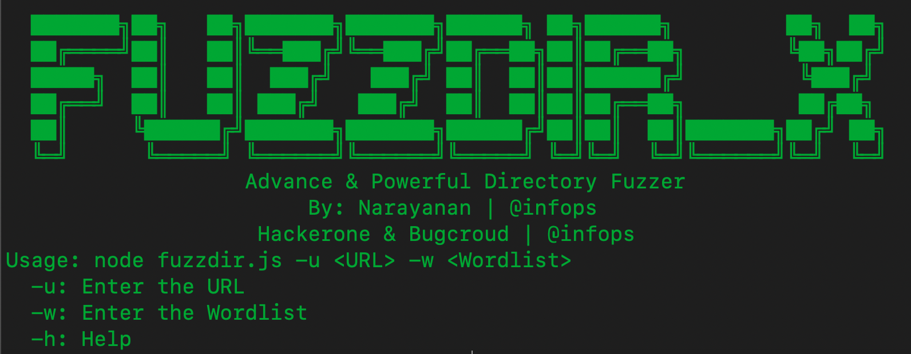

<h1 align="center">
  <br>
  <a href="https://github.com/Narayanan-info/Redir_X/"></a>
  <br>
  FuzzDir_X
  <br>
</h1>

<h4 align="center">Advanced ( 🔥 ) Powerful Directory Fuzzer Suite</h4>

<p align="center">
  <a href="https://github.com/Narayanan-info/Redir_X/">
    
  </a>
  <a href="https://travis-ci.com/s0md3v/XSStrike">
    
  </a>
  <a href="https://github.com/s0md3v/XSStrike/issues?q=is%3Aissue+is%3Aclosed">
      
  </a>
</p>

---

`FuzzdirX` is a Advance & Powerful Directory Fuzzer Suite that returns a valid directory with the status code and saves it into your tool directory Ffile called `OUTPUT` , using Active Online Sources. It has a simple, modular architecture and is optimised for speed. `FuzzdirX` is built for doing one thing only: - Advance & Powerful Directory Fuzzing, and it does that very well.

The Active model guarantees speed and stealthiness that can be leveraged by both penetration testers and bug bounty hunters alike.

# Features

<h1 align="left">
  </a>
  <br>
</h1>

- Fast and powerful resolution - [ Active Directory Fuzzing ]
- **Curated** Active sources to maximize results
- Optimized for speed and **lightweight** on resources
- **STDIN/OUT** support enables easy integration into workflows

# Execution

<h1 align="left">
  </a>
  <br>
</h1>

# Usage

`Usage` This command is used to execute the function of the tool then actively validate the url and fuzz the directory super fast ( 🔥 )

```sh
node FuzzdirX.js -u <URL> -w <Wordlist> 
```

# License 

`FuzzdirX` is my first tool for pentesting and bug bounty hunting with love. Certainly! The MIT License is a permissive open-source software license that allows developers to use, modify, distribute, and sublicense the software with very few `restrictions`. It is widely used in the software development community due to its simplicity and permissiveness. Under the MIT License, users can freely use the software in both personal and commercial projects, as long as they include the original copyright notice and disclaimers. This license is often favored for its flexibility and encouragement of collaboration among `developers`.


